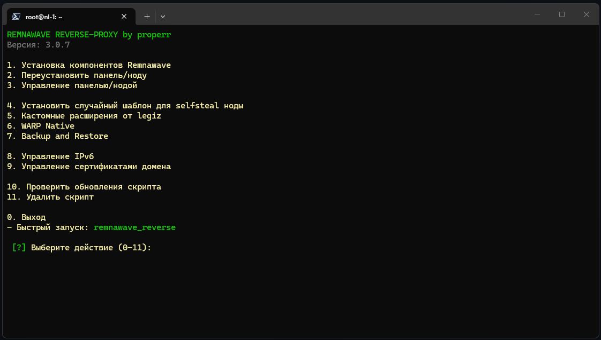

<p align="center">
  
</p>

<p align="center">
   <strong>Русская сборка</strong>
</p>

---

# Remnawave Reverse Proxy

Установщик панели управления и нод **Remnawave** — готовое решение для раздачи VPN на своём сервере. Всё настраивается автоматически: после установки панель уже работает, инбаунд создан, ключи сгенерированы.

Сборка полностью на русском языке.

---

## Что умеет

- **Панель + нода** — на одном сервере или на разных
- **Всё из коробки** — при установке автоматически создаётся рабочий конфиг: ключи генерируются сами, ваш домен подставляется сам, ничего настраивать вручную не нужно
- **nginx или Caddy** — на выбор
- **Сайт-заглушка** — сервер маскируется под обычный сайт: свои клиенты получают VPN, посторонние видят обычный сайт
- **SSL-сертификаты** — выпускаются и обновляются автоматически
- **Защита панели** — вход только по секретному адресу, без него панель не видна
- **Только русский язык** — без лишних вопросов при установке

---

## Требования

- **ОС:** Debian 11 / 12 / 13 или Ubuntu 22.04 / 24.04, свежая установка
- **Доступ:** root
- **Домены:** свой домен + поддомены (панель, страница подписок, домен для заглушки)

---

## Быстрый старт

```bash
bash <(curl -Ls https://raw.githubusercontent.com/properr/remnawave-reverse-proxy/refs/heads/main/install_remnawave.sh)
```

Скрипт сам всё сделает: установит, настроит, сгенерирует ключи и покажет логин с паролем от панели.

<p align="center">
  
</p>

---

## Режимы установки

| Режим | Когда нужен |
|-------|-------------|
| **Панель + нода на одном сервере** | Компактная установка, умеренный трафик |
| **Только панель** | Центр управления без VPN-ноды |
| **Только нода** | Отдельный сервер с VPN, подключается к панели по ключу |

---

## Настройка DNS

**Один сервер (панель + нода):**

| Тип | Имя | Значение | Прокси |
|-----|-----|----------|--------|
| A | example.com | IP сервера | DNS only |
| CNAME | panel.example.com | example.com | DNS only |
| CNAME | sub.example.com | example.com | DNS only |
| CNAME | node.example.com | example.com | DNS only |

**Раздельная установка:** `node.example.com` → IP сервера ноды, остальное → IP панели.

---

## Обновление

Установщик умеет обновлять сам себя из этого репозитория — пункт меню «Обновление».

---

## Структура репозитория

```
install_remnawave.sh   — основной скрипт (меню установки)
src/nginx/             — модули установки для nginx
src/caddy/             — модули установки для Caddy
src/modules/           — управление панелью, нодами, Warp, IPv6
src/api/               — работа с API панели
src/lang/              — языковой файл (русский)
```

---

> [!CAUTION]
> Инструмент предназначен для администрирования собственных серверов. Запускайте только на своих серверах и на свой страх и риск — за всё, что вы делаете с его помощью, отвечаете вы сами.
